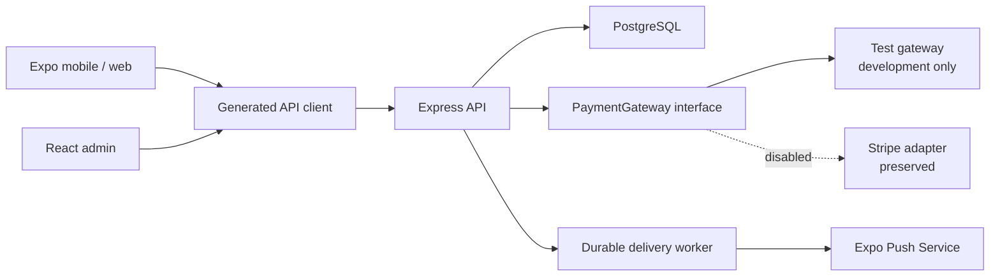

# MARSA Marketplace Update Implementation Guide

## Document status

This guide turns `UPDATE_IMPLEMENTATION_PLAN.md` into an implementation
specification for the existing MARSA monorepo. It is intentionally written
against the current repository structure rather than as a generic product
proposal.

The implementation has not been completed merely because this document
exists. Each phase below has an exit gate that must pass before the next phase
is considered complete.

## Scope

This release implements:

- Separate guest and host mobile interfaces with a remembered mode.
- A guest Home tab, separate Explore tab, location search, disabled Buy
  intent, and location-based yacht rails.
- Admin-managed locations with an Other/custom location choice.
- Guest wishlists.
- A per-yacht host calendar with multiple slots and per-slot prices.
- Removal of the redundant platform-fee sentence while retaining the host
  earnings calculator.
- Guaranteed exclusion of suspended yachts from public surfaces.
- Admin reactivation and featured-yacht controls.
- Per-admin unseen-data badges.
- Admin broadcasts with in-app and push delivery and a future email seam.
- Admin-managed, versioned cancellation-fee tiers based on time remaining
  before trip start, with immutable booking-time terms.
- A provider-neutral payment boundary.
- Stripe disabled but preserved.
- A development-only test gateway that bypasses real payment.
- Contract seams for a later, separate boat-sale listing module.

This release does not implement:

- Sale listing creation.
- Seller subscriptions.
- Sale inquiries.
- A real replacement payment gateway.
- Email delivery.
- Removal of Stripe packages, tables, columns, routes, or history.

## Non-negotiable architecture rules

1. `lib/api-spec/openapi.yaml` remains the API contract source of truth.
2. Generated files under `lib/api-client-react/src/generated/` and
   `lib/api-zod/src/generated/` are never edited by hand.
3. Every OpenAPI change is followed by code generation before frontend work.
4. Every protected server query checks ownership or role on the server.
5. Mobile interface mode is presentation state, not authorization state.
6. Public yacht queries always include `yachts.status = "live"` server-side.
7. Booking totals, slot prices, platform fees, and payment states are computed
   by the server. The client is never trusted for money or payment status.
8. Test payment is selected only by server environment configuration. A
   request body or mobile flag cannot activate it.
9. Test payment fails closed in production and in a published Replit
   deployment.
10. Database changes are additive for this release. Do not drop the legacy
    location fields or Stripe fields.
11. Replit paths, ports, domain variables, object storage, and multi-artifact
    workflows remain supported.
12. `.env` files and secret values never enter Git.
13. Cancellation fees are calculated only by the API from the cancellation
    request instant to the booked trip-start instant; clients display results
    but never duplicate the formula.
14. Activated cancellation-policy versions and booking terms are immutable.
    A later admin change cannot alter an existing booking.
15. A cancellation request does not make its slot available. The slot is
    released only after cancellation approval and successful refund handling.

## Current repository anchors

| Concern | Current source |
|---|---|
| Database schemas | `lib/db/src/schema/` |
| DB exports | `lib/db/src/schema/index.ts` |
| OpenAPI | `lib/api-spec/openapi.yaml` |
| Generated hooks | `lib/api-client-react/src/generated/` |
| Generated validators/types | `lib/api-zod/src/generated/` |
| API routes | `artifacts/api-server/src/routes/` |
| Mobile routes | `artifacts/marsa-mobile/app/` |
| Mobile shared components | `artifacts/marsa-mobile/components/` |
| Admin routes | `artifacts/marsa-admin/src/App.tsx` |
| Admin navigation | `artifacts/marsa-admin/src/components/AdminLayout.tsx` |
| Replit definition | `.replit` |
| Replit mobile build | `artifacts/marsa-mobile/scripts/build.js` |
| Replit mobile server | `artifacts/marsa-mobile/server/serve.js` |
| Existing seed | `scripts/src/seed.ts` |

## Target request flow



## Phase 0 - Isolate work and record a baseline

### Branch

Use:

```bash
git switch -c codex/guest-host-marketplace-prep
```

If the branch already exists:

```bash
git switch codex/guest-host-marketplace-prep
```

Do not implement this update directly on `main`.

### Record the baseline

Before feature changes:

```bash
git status --short
pnpm install --frozen-lockfile
pnpm run typecheck
pnpm --filter @workspace/api-server run test
pnpm --filter @workspace/marsa-mobile exec expo install --check
```

Also capture:

- Current database row counts for users, yachts, slots, bookings, payments,
  refunds, notifications, locations, and cancellation-related tables if they
  already exist.
- Current Replit workflow names, ports, and base paths.
- A successful API health response.
- A successful admin load under `/marsa-admin/`.
- A successful Expo web export.

### Phase 0 exit gate

- Work is on the feature branch.
- Existing failures are documented rather than silently attributed to the
  update.
- The worktree contains no unknown generated or secret files.

## Phase 1 - Environment and runtime configuration

### Root environment variables

Update `.env.example` and the ignored local `.env`:

```env
# Existing
NODE_ENV=development
PORT=8080
DATABASE_URL=
CLERK_PUBLISHABLE_KEY=
CLERK_SECRET_KEY=
VITE_CLERK_PUBLISHABLE_KEY=
SESSION_SECRET=
INTERNAL_SECRET_TOKEN=
DEFAULT_MARKET_TIME_ZONE=Africa/Cairo

# Payment selection
PAYMENT_GATEWAY=test
ENABLE_TEST_PAYMENT_GATEWAY=true

# Stripe remains optional and blank while disabled
STRIPE_PUBLISHABLE_KEY=
STRIPE_SECRET_KEY=
STRIPE_WEBHOOK_SECRET=
```

Rules:

- `PAYMENT_GATEWAY` accepts `test`, `stripe`, or `disabled`.
- `ENABLE_TEST_PAYMENT_GATEWAY=true` is an additional explicit development
  guard.
- `PAYMENT_GATEWAY=test` is allowed only when:
  `NODE_ENV !== "production"`,
  `REPLIT_DEPLOYMENT !== "1"`, and
  `ENABLE_TEST_PAYMENT_GATEWAY === "true"`.
- A forbidden test configuration resolves to `disabled`; it must not fall
  back to Stripe and must not approve a booking.
- Stripe keys are validated only when `PAYMENT_GATEWAY=stripe`.
- `VITE_CLERK_PUBLISHABLE_KEY`, `CLERK_PUBLISHABLE_KEY`, and
  `EXPO_PUBLIC_CLERK_PUBLISHABLE_KEY` use the same Clerk publishable value.
- `CLERK_SECRET_KEY` remains server-only.
- `DEFAULT_MARKET_TIME_ZONE` must be a valid IANA time-zone name. It is used
  only for legacy/custom-location bookings that do not resolve an
  admin-managed location time zone.

### Mobile environment variables

Keep `artifacts/marsa-mobile/.env.example` limited to client-safe values:

```env
EXPO_PUBLIC_CLERK_PUBLISHABLE_KEY=
EXPO_PUBLIC_API_URL=http://localhost:8080
EXPO_PUBLIC_DOMAIN=
EXPO_PUBLIC_REPL_ID=
```

Remove the requirement to provide an Expo Stripe key. It may stay as a
documented optional legacy variable while Stripe remains preserved, but the
test gateway must not read it.

### Admin local environment

Vite loads environment files relative to `artifacts/marsa-admin`, while
Replit supplies process environment variables through its workflow. Add:

`artifacts/marsa-admin/.env.example`

```env
PORT=5173
BASE_PATH=/
VITE_CLERK_PUBLISHABLE_KEY=
VITE_CLERK_PROXY_URL=
```

Keep the real `artifacts/marsa-admin/.env` ignored. Do not change Replit's
`BASE_PATH=/marsa-admin/` workflow value.

### Central payment configuration

Add:

`artifacts/api-server/src/lib/payments/config.ts`

It should export a parsed, readonly configuration object and a function such
as `getPaymentGatewayName()`. Parse once at process start and log only:

- Selected gateway.
- Whether checkout is enabled.
- Whether test mode is active.

Never log keys, tokens, `DATABASE_URL`, or payment metadata containing
personal information.

### Phase 1 exit gate

- The API starts without Stripe variables when the test gateway is selected.
- The API refuses test checkout under simulated `NODE_ENV=production`.
- The API refuses test checkout under simulated `REPLIT_DEPLOYMENT=1`.
- Local, Replit development, and published Replit configuration are described
  separately.

## Phase 2 - Additive database schema

### General rules

- Add schema files under `lib/db/src/schema/`.
- Export every new file from `lib/db/src/schema/index.ts`.
- Use `text` UUIDs and `randomUUID()` to match existing tables.
- Use timezone-aware timestamps.
- Preserve `yachts.location`, `yachts.city`,
  `payments.stripePaymentIntentId`, `payments.stripeChargeId`,
  `refunds.stripeRefundId`, and `host_profiles.stripeConnectId`.
- Use `onDelete: "restrict"` for financial history.
- Use `onDelete: "cascade"` only for user-owned convenience data such as
  wishlist rows and device tokens.
- Add indexes for every foreign key or frequent filter used by the new APIs.

### 2.1 Locations

Add `lib/db/src/schema/locations.ts`.

`locations`:

| Column | Drizzle type | Rules |
|---|---|---|
| `id` | `text` | primary key |
| `name` | `text` | not null; display name |
| `city` | `text` | not null |
| `country` | `text` | not null |
| `timeZone` | `text` | not null; valid IANA name; default `Africa/Cairo` for Gouna |
| `slug` | `text` | not null; unique |
| `isActive` | `boolean` | not null; default true |
| `isDefault` | `boolean` | not null; default false |
| `sortOrder` | `integer` | not null; default 0 |
| `createdAt` | timezone timestamp | default now |
| `updatedAt` | timezone timestamp | default now/on update |

Indexes and invariants:

- Unique `slug`.
- Index `(isActive, sortOrder)`.
- Only one row may have `isDefault=true`. Enforce with a partial unique index
  if Drizzle generates it correctly; otherwise enforce transactionally and
  cover with tests.
- A default location cannot be deactivated until another active location is
  selected as default.
- Validate `timeZone` with `Intl.DateTimeFormat` or the chosen date library;
  never accept a fixed UTC offset because daylight-saving rules can change.

Do not create a real `Other` location row. `Other` is a UI sentinel. New
custom listings use `locationId=null` plus `customLocationName`.

Extend `lib/db/src/schema/yachts.ts`:

| Column | Type | Rules |
|---|---|---|
| `locationId` | nullable text FK | references locations, `set null` |
| `customLocationName` | nullable text | required by API for Other |
| `isFeatured` | boolean | not null, default false |
| `featuredSortOrder` | integer | not null, default 0 |
| `featuredFrom` | nullable timezone timestamp | optional window |
| `featuredUntil` | nullable timezone timestamp | optional window |

Keep `location` and `city` populated as denormalized display fallbacks during
this release. This prevents older mobile bundles and Replit data from
breaking during rollout.

### 2.2 Wishlist

Add `lib/db/src/schema/wishlistItems.ts`.

`wishlist_items`:

| Column | Type | Rules |
|---|---|---|
| `id` | text | primary key |
| `userId` | text FK | users; cascade |
| `yachtId` | text FK | yachts; cascade |
| `createdAt` | timezone timestamp | default now |

Add:

- Unique `(userId, yachtId)`.
- Index on `userId`.
- Index on `yachtId`.

### 2.3 Availability slot pricing and holds

Extend `lib/db/src/schema/availabilitySlots.ts`:

| Column | Type | Rules |
|---|---|---|
| `priceOverrideEgp` | nullable decimal(12,2) | positive when present |
| `holdExpiresAt` | nullable timezone timestamp | external-payment recovery |

Keep `isAvailable` in this release for compatibility. Derive display state:

- `available`: `isAvailable=true` and not past.
- `blocked`: `isAvailable=false` with no active booking.
- `held`: active `pending_payment` booking whose hold has not expired.
- `booked`: paid-under-review, confirmed, or completed booking.
- `past`: date/time is before now; computed, not stored.

The effective slot price is:

```text
priceOverrideEgp ?? yacht_template_pricing.price
```

The server copies the effective amount to `bookings.baseAmountEgp`. Historical
bookings never read a live slot or template price.

### 2.4 Provider-neutral payment metadata

Extend `lib/db/src/schema/payments.ts`:

| Column | Type | Rules |
|---|---|---|
| `provider` | text | not null; default `stripe` for legacy rows |
| `providerPaymentId` | nullable text | provider reference |
| `providerMetadata` | nullable jsonb | sanitized provider response |
| `isTest` | boolean | not null; default false |
| `succeededAt` | nullable timezone timestamp | set on success |

Add:

- Index on `bookingId`.
- Unique `(provider, providerPaymentId)` where provider reference is not null.

Extend `lib/db/src/schema/refunds.ts`:

| Column | Type | Rules |
|---|---|---|
| `provider` | text | not null; default `stripe` |
| `providerRefundId` | nullable text | provider reference |
| `isTest` | boolean | not null; default false |

Keep all Stripe-specific fields. For legacy records, backfill:

- `provider="stripe"`.
- `providerPaymentId=stripePaymentIntentId` when present.
- `providerRefundId=stripeRefundId` when present.
- `isTest=false`.

Test records use:

- `provider="test"`.
- IDs beginning with `test_pay_` or `test_ref_`.
- `status="succeeded"` immediately.
- EGP amount populated.
- USD amount and exchange rate left null.
- No receipt URL.

### 2.5 Admin unseen activity

Add `lib/db/src/schema/adminActivity.ts`.

`admin_events`:

| Column | Type |
|---|---|
| `id` | text primary key |
| `sectionKey` | text not null |
| `entityType` | text not null |
| `entityId` | text not null |
| `eventType` | text not null |
| `metadata` | nullable jsonb |
| `occurredAt` | timezone timestamp default now |

Indexes:

- `(sectionKey, occurredAt)`.
- `(entityType, entityId)`.

`admin_section_views`:

| Column | Type |
|---|---|
| `adminUserId` | text FK to users, cascade |
| `sectionKey` | text |
| `lastSeenAt` | timezone timestamp |

Use `(adminUserId, sectionKey)` as a composite primary key or unique key.

Use stable section keys:

```text
users
hosts
documents
yachts
bookings
cancellations
withdrawals
reviews
photographer_requests
```

### 2.6 Broadcast and push delivery

Add `lib/db/src/schema/notificationCampaigns.ts`.

`notification_campaigns`:

- `id`
- `title`
- `message`
- `audience` text, initially `all`
- `status`: `queued`, `sending`, `completed`, `partial_failed`, `failed`
- `createdBy` FK to users, restrict
- `totalRecipients`
- `inAppSentCount`
- `pushSentCount`
- `pushFailedCount`
- `createdAt`
- `startedAt`
- `completedAt`

`notification_deliveries`:

- `id`
- `campaignId` FK, restrict
- `userId` FK, restrict
- `channel`: `in_app`, `push`, or `email`
- `pushTokenId` nullable FK
- `notificationId` nullable FK
- `status`: `pending`, `sent`, `failed`, `skipped`
- `attemptCount`
- `providerReference`
- `lastError`
- `nextAttemptAt`
- `createdAt`
- `sentAt`

Add idempotency constraints so one campaign cannot create duplicate in-app
delivery for one user or duplicate push delivery for one active device token.
Keep `email` valid in the data model but do not enqueue email deliveries yet.

Add `lib/db/src/schema/userPushTokens.ts`.

`user_push_tokens`:

- `id`
- `userId` FK, cascade
- `expoPushToken`
- `deviceId`
- `platform`: `ios`, `android`
- `appVersion`
- `isActive`
- `lastRegisteredAt`
- `deactivatedAt`
- `createdAt`
- `updatedAt`

Constraints:

- Unique Expo push token.
- Prefer unique `(userId, deviceId)` where device ID is present.
- Never return another user's token through the API.

### 2.7 Versioned cancellation policies and requests

Add `lib/db/src/schema/cancellationPolicies.ts`.

`cancellation_policies`:

| Column | Type | Rules |
|---|---|---|
| `id` | text | primary key |
| `name` | text | not null; admin-facing label |
| `version` | integer | not null; positive; globally unique |
| `status` | text | `draft`, `active`, or `retired`; default `draft` |
| `createdBy` | text FK | users; restrict |
| `activatedAt` | nullable timezone timestamp | set once on activation |
| `retiredAt` | nullable timezone timestamp | set when replaced |
| `createdAt` | timezone timestamp | default now |
| `updatedAt` | timezone timestamp | default now/on update |

Add a partial unique index allowing only one row where `status='active'`.
Drafts may be edited; active and retired rows are read-only. To change an
active policy, clone it into the next draft version and activate the clone in a
transaction that retires the prior active version.

`cancellation_policy_rules`:

| Column | Type | Rules |
|---|---|---|
| `id` | text | primary key |
| `policyId` | text FK | cancellation policies; cascade only for deletable drafts |
| `minimumMinutesBeforeTrip` | integer | not null; at least zero |
| `feePercentage` | decimal(5,2) | not null; from 0 through 100 |
| `createdAt` | timezone timestamp | default now |
| `updatedAt` | timezone timestamp | default now/on update |

Add:

- Unique `(policyId, minimumMinutesBeforeTrip)`.
- Index `(policyId, minimumMinutesBeforeTrip DESC)`.
- An activation invariant requiring a zero-minute catch-all rule.
- At least one rule before activation.

The admin UI accepts hours or days, but converts the value to whole minutes
before sending it. At quote time:

1. Compute the exact trip start as a UTC instant using the booking date/time
   and the location's IANA time zone.
2. Compute
   `remainingMinutes = floor((tripStartsAt - requestedAt) / 60000)`.
3. Reject ordinary guest cancellation if `remainingMinutes < 0`.
4. Sort rules by `minimumMinutesBeforeTrip` descending.
5. Use the first rule where
   `remainingMinutes >= minimumMinutesBeforeTrip`.

Example only; do not seed these values:

| Minimum time remaining | Fee |
|---|---|
| 48 hours | 5% |
| 24 hours | 20% |
| 0 hours | 50% |

That means at least 48 hours uses 5%, at least 24 but less than 48 uses 20%,
and from trip start up to less than 24 hours uses 50%. Exact threshold
boundaries use the rule configured at that exact threshold.

Add `lib/db/src/schema/bookingCancellationTerms.ts`.

`booking_cancellation_terms`:

| Column | Type | Rules |
|---|---|---|
| `id` | text | primary key |
| `bookingId` | text FK | bookings; restrict; unique |
| `policyId` | text FK | cancellation policies; restrict |
| `policyVersion` | integer | not null; snapshot |
| `policyName` | text | not null; snapshot |
| `rulesSnapshot` | jsonb | not null; normalized threshold/percentage array |
| `tripStartsAt` | timezone timestamp | not null; immutable UTC instant |
| `timeZone` | text | not null; IANA name used for conversion |
| `acceptedAt` | timezone timestamp | not null |
| `createdAt` | timezone timestamp | default now |

The rules snapshot contains only normalized business data, for example
`[{ minimumMinutesBeforeTrip, feePercentage }]`; it never contains secrets or
client-provided totals. Insert this row in the same transaction as every new
booking. This new table intentionally avoids adding a cancellation-policy
column to the legacy `bookings` table.

Add `lib/db/src/schema/bookingCancellations.ts`.

`booking_cancellations`:

| Column | Type | Rules |
|---|---|---|
| `id` | text | primary key |
| `bookingId` | text FK | bookings; restrict |
| `requestedBy` | text FK | users; restrict |
| `reason` | nullable text | bounded length |
| `requestedAt` | timezone timestamp | not null |
| `bookingStatusBeforeRequest` | text | not null; restore on rejection |
| `tripStartsAt` | timezone timestamp | not null; quote snapshot |
| `remainingMinutes` | integer | not null |
| `policyId` | nullable text FK | cancellation policies; restrict |
| `policyVersion` | nullable integer | null only for legacy/manual review |
| `matchedRuleId` | nullable text FK | cancellation policy rules; restrict |
| `feePercentage` | nullable decimal(5,2) | server-calculated |
| `originalAmountEgp` | decimal(12,2) | immutable paid-total snapshot |
| `feeAmountEgp` | nullable decimal(12,2) | server-calculated |
| `refundAmountEgp` | nullable decimal(12,2) | server-calculated |
| `status` | text | `pending`, `processing`, `approved`, `rejected`, `refund_failed` |
| `reviewedBy` | nullable text FK | users; restrict |
| `reviewedAt` | nullable timezone timestamp | |
| `reviewNotes` | nullable text | bounded length |
| `refundId` | nullable text FK | refunds; restrict |
| `createdAt` | timezone timestamp | default now |
| `updatedAt` | timezone timestamp | default now/on update |

Add:

- Index `(bookingId, requestedAt DESC)`.
- Index `(status, requestedAt)`.
- Partial unique index on `bookingId` while status is `pending` or
  `processing`, preventing duplicate open requests.
- Checks that monetary values are non-negative and
  `feeAmountEgp + refundAmountEgp = originalAmountEgp` when both exist.

All money calculations use integer piasters in application code and are copied
to decimal columns only at the DB boundary. The request, quote, matched rule,
and amounts are audit snapshots; never recalculate historical rows for display.

Do not seed the illustrative percentages. Deployment requires an admin to
create and activate the real policy before new checkout is enabled. Existing
bookings with no `booking_cancellation_terms` row are marked
`manualReviewRequired` by the API; do not invent or backfill policy terms for
them without an approved business rule.

### 2.8 Idempotent backfill

Add `scripts/src/backfill-marketplace-update.ts` and a package script:

```json
"backfill:marketplace-update": "tsx ./src/backfill-marketplace-update.ts"
```

The script must:

1. Run in a DB transaction where practical.
2. Upsert `Gouna, Egypt` with stable slug `gouna-egypt`, active/default true.
3. If another default exists, preserve it and make Gouna non-default instead
   of creating two defaults.
4. Backfill `yachts.locationId` only when the existing city/location clearly
   matches Gouna or El Gouna.
5. Preserve non-Gouna values as legacy/custom data. Do not silently relabel.
6. Copy legacy Stripe references into provider-neutral fields.
7. Never modify booking monetary snapshots.
8. Print counts, not secrets or user data.
9. Be safe to run repeatedly.
10. Exit non-zero on invariant failure.
11. Do not seed the example cancellation percentages.
12. Do not attach the newly configured policy retroactively to old bookings.

Do not add sample yachts, bookings, users, or payments in this backfill.

### Phase 2 exit gate

- A disposable/local database accepts `drizzle-kit push`.
- The backfill succeeds twice with identical counts.
- Existing bookings and payments remain readable.
- Exactly one active default location exists.
- No legacy location was incorrectly converted.
- Stripe fields remain present.
- Cancellation-policy tables and constraints exist without changing legacy
  booking rows.
- No example cancellation policy was silently activated.

## Phase 3 - OpenAPI and generated clients

### Update order

1. Edit `lib/api-spec/openapi.yaml`.
2. Add named component schemas; do not inline request bodies.
3. Run:

   ```bash
   pnpm --filter @workspace/api-spec run codegen
   ```

4. Review generated diffs.
5. Run:

   ```bash
   pnpm run typecheck:libs
   ```

Do not begin mobile/admin hook changes before generation succeeds.

### New/changed public contracts

| Method | Path | Operation |
|---|---|---|
| GET | `/locations` | `listLocations` |
| GET | `/discovery/home` | `getDiscoveryHome` |
| GET | `/wishlist` | `listWishlist` |
| GET | `/wishlist/ids` | `listWishlistIds` |
| POST | `/wishlist/{yachtId}` | `addWishlistItem` |
| DELETE | `/wishlist/{yachtId}` | `removeWishlistItem` |
| GET | `/payments/config` | `getPaymentConfig` |
| GET | `/cancellation-policy/current` | `getCurrentCancellationPolicy` |
| GET | `/bookings/{id}/cancellation-quote` | `getBookingCancellationQuote` |
| POST | `/bookings/{id}/cancel` | `requestBookingCancellation` |

Extend `GET /yachts` with:

- `locationId`
- `intent`, enum `rent|buy`

The server currently supports only `rent`. Mobile Buy remains disabled and
must never send a request. If a manual caller sends `intent=buy`, return a
clear `400`/feature-unavailable response rather than mixing sale and rental
records.

### Host contracts

| Method | Path | Operation |
|---|---|---|
| GET | `/host/yachts/{id}` | `getHostYacht` |
| GET | `/host/yacht-availability` | `getHostYachtAvailability` |
| POST | `/host/yachts/{id}/availability` | `setYachtAvailability` |

Use the query-only shape:

```text
/host/yacht-availability?yachtId=...&from=...&to=...
```

This avoids the repository's documented Orval path-plus-query collision.

Change booking input to require `slotId`. Keep yacht/template/date/time in the
response, but derive and validate them from the selected slot server-side.

`AvailabilitySlot` should add:

- `priceOverrideEgp`
- `effectivePriceEgp`
- `displayStatus`
- `editable`
- `bookingId` only for the owning host/admin response

Do not expose another guest's booking identity in public availability.

### Admin contracts

Add:

- `GET /admin/locations`
- `POST /admin/locations`
- `PATCH /admin/locations/{id}`
- `POST /admin/locations/{id}/deactivate`
- `POST /admin/yachts/{id}/reactivate`
- `PATCH /admin/yachts/{id}/featured`
- `GET /admin/activity/unseen-counts`
- `POST /admin/activity/sections/{sectionKey}/seen`
- `GET /admin/notification-campaigns`
- `POST /admin/notification-campaigns`
- `GET /admin/notification-campaigns/{id}`
- `GET /admin/cancellation-policies`
- `POST /admin/cancellation-policies`
- `PATCH /admin/cancellation-policies/{id}`
- `PUT /admin/cancellation-policies/{id}/rules`
- `POST /admin/cancellation-policies/{id}/activate`
- `GET /admin/cancellations`
- `POST /admin/cancellations/{id}/process`

Policy update and rule replacement endpoints accept drafts only. Activation is
a separate auditable action. Cancellation processing addresses the durable
cancellation request ID, not just a booking ID.

### Push contracts

Add:

- `POST /push-tokens`
- `DELETE /push-tokens/{id}`

The registration body includes token, platform, device ID, and app version.
The authenticated user ID always comes from `requireAuth`, not the body.

### Payment schemas

Replace the Stripe-specific required booking response with:

```text
BookingCreateResponse
  booking: Booking
  cancellationTerms: CancellationTermsSummary
  payment:
    gateway: test | stripe | disabled
    testMode: boolean
    status: created | succeeded | failed
    action:
      type: none | stripe_payment_sheet
      clientSecret?: string
    providerPaymentId?: string
```

Rules:

- `clientSecret` is optional and appears only for Stripe.
- Test success returns `action.type="none"` and `status="succeeded"`.
- Disabled checkout returns a service-unavailable error before a booking is
  reserved.
- Payment/receipt response schemas include `provider` and `isTest`.
- OpenAPI summaries use "payment gateway", not "Stripe", except for the
  preserved Stripe webhook endpoint.

### Cancellation schemas

Add named schemas:

```text
CancellationPolicyRule
  id
  minimumMinutesBeforeTrip
  feePercentage

CancellationPolicy
  id
  name
  version
  status
  rules[]
  activatedAt?

CancellationTermsSummary
  policyName
  policyVersion
  tripStartsAt
  timeZone
  rules[]

CancellationQuote
  bookingId
  tripStartsAt
  requestedAt
  remainingMinutes
  matchedRuleId?
  feePercentage?
  originalAmountEgp
  feeAmountEgp?
  refundAmountEgp?
  manualReviewRequired

CancellationRequestInput
  reason?
  acceptedRuleId?
  acceptedFeeAmountEgp?

CancellationProcessInput
  decision: approve | reject
  notes?
  manualFeePercentage?
```

EGP amounts are decimal strings in JSON, never floating-point numbers.
`acceptedRuleId` and `acceptedFeeAmountEgp` are an optimistic-concurrency
guard, not trusted calculation inputs. The API recalculates the quote. If the
rule or amount changed while the user was confirming, return `409` with a
fresh `CancellationQuote` and do not create a request.

For a legacy booking with no terms snapshot, return
`manualReviewRequired=true` and null automatic fee/refund fields. Do not apply
the currently active policy retroactively. `manualFeePercentage` is accepted
only for such a legacy request, requires review notes, and is server-validated
from 0 through 100; it is never accepted as an override for a snapshotted
booking.

### Phase 3 exit gate

- Codegen succeeds without export collisions.
- Generated files contain every new hook/schema.
- No frontend file imports a generated internal path.
- Full library typecheck passes.

## Phase 4 - API implementation

### 4.1 Shared helpers

Add focused modules instead of growing existing route files indefinitely:

```text
artifacts/api-server/src/lib/
  adminActivity.ts
  money.ts
  payments/
    config.ts
    types.ts
    index.ts
    testGateway.ts
    stripeGateway.ts
  cancellations/
    types.ts
    time.ts
    matchRule.ts
    quote.ts
  push/
    expoPush.ts
    deliveryWorker.ts
```

Suggested route files:

```text
artifacts/api-server/src/routes/
  discovery.ts
  locations.ts
  wishlist.ts
  pushTokens.ts
  adminActivity.ts
  adminLocations.ts
  adminCampaigns.ts
  cancellationPolicy.ts
  adminCancellationPolicies.ts
  adminCancellations.ts
```

Mount public routers before broad authenticated routers and keep every
`router.use(requireAuth)` path-scoped.

### 4.2 Money helper

In `lib/money.ts`:

- Parse EGP decimal strings into integer piasters.
- Add line items using integers.
- Calculate the 20% fee with one documented rounding rule.
- Calculate cancellation percentage amounts with the same integer-piaster
  rounding rule.
- Convert back to a two-decimal string at DB boundaries.
- Reject negative, malformed, NaN, and unsafe values.

Do not use client totals. Do not perform fee calculations independently in
multiple route files.

### 4.3 Payment gateway interface

In `lib/payments/types.ts`, define provider-neutral types for:

- Public configuration.
- Checkout creation result.
- Refund result.
- Provider status.
- Provider references.

The interface should provide:

```text
name
getPublicConfig()
createCheckout(input)
refund(input)
```

`testGateway.ts`:

- Performs no network request.
- Generates `test_pay_<uuid>`.
- Returns succeeded immediately.
- Never accepts a result/status from the client.
- Records only sanitized test metadata.

`stripeGateway.ts`:

- Moves current PaymentIntent/refund calls from `bookings.ts`,
  `payments.ts`, and rejection handlers behind the interface.
- Keeps current exchange-rate conversion behavior.
- Loads Stripe only when selected.
- Preserves webhook handling.
- Is not selected in this release.

`index.ts`:

- Returns one configured gateway instance.
- Returns a disabled gateway when test mode is forbidden.
- Never silently changes from test to Stripe.

### 4.4 Atomic booking creation

Refactor `artifacts/api-server/src/routes/bookings.ts`.

Validation order:

1. Authenticate user.
2. Load the selected gateway; reject if disabled.
3. Validate `slotId`.
4. Load slot, live yacht, active template, and active fallback pricing.
5. Verify slot belongs to the yacht/template shown to the client.
6. Reject past slots.
7. Validate guest capacity.
8. Deduplicate add-on IDs and load active add-ons.
9. Enforce template-specific add-on compatibility if configured.
10. Calculate effective base price and total server-side.
11. Load the one active cancellation policy and its validated rules.
12. Resolve `tripStartsAt` using the location IANA time zone, falling back to
    `DEFAULT_MARKET_TIME_ZONE` only for legacy/custom locations.

Reservation transaction:

1. Atomically claim the slot:

   ```sql
   UPDATE availability_slots
   SET is_available = false, hold_expires_at = ...
   WHERE id = $slotId AND is_available = true
   RETURNING *;
   ```

2. If no row returns, respond `409 Slot no longer available`.
3. Check active bookings for the same yacht/date whose calculated time range
   overlaps this slot. Lock the relevant rows or use a transaction/advisory
   lock so two concurrent requests cannot both pass.
4. Insert booking with immutable monetary snapshots.
5. Insert add-on snapshots.
6. Insert `booking_cancellation_terms` with policy/rule/trip-time snapshots.
7. Insert a payment row with the selected provider.
8. Commit.

If no active, valid cancellation policy exists, return a clear service
configuration error before claiming the slot. Never silently supply the
illustrative example rules.

Gateway/finalization:

- Test gateway: finalize payment as succeeded and booking as
  `paid_under_review`; clear `holdExpiresAt`.
- Stripe adapter when re-enabled: create the external intent after the durable
  reservation exists, then update its provider ID/client action.
- On gateway failure: mark payment failed and restore the slot only if the
  booking is still `pending_payment`.
- A scheduled cleanup route restores expired payment holds after crashes.

Notifications and admin events:

- Notify the guest of test-payment success.
- Notify the host of a paid booking awaiting review.
- Record a `bookings` admin event only after durable success.
- Use Pino (`req.log`), not `console.log`.

Idempotency:

- Accept an `Idempotency-Key` header or a generated client request ID.
- Persist it on the booking or a dedicated request table.
- A retried request returns the existing booking instead of reserving twice.
- Scope uniqueness to authenticated user plus key.

### 4.5 Provider-aware rejection/refund

Create one provider-aware refund service used by host rejection and by the
cancellation processor in section 4.7:

1. Load the succeeded payment.
2. Resolve the gateway using `payment.provider`, not current environment.
3. Accept a server-calculated EGP refund amount and stable idempotency key.
4. Test refunds return immediate logical success without network.
5. Insert/update a provider-neutral refund row.
6. Return a typed result to the calling business-state transition.

For host rejection, the caller transaction marks payment/refund complete,
marks the booking `rejected_refunded`, restores the slot if no other active
booking uses it, then notifies the guest and writes the audit log.

For cancellation, do not reuse the host-rejection booking status or assume a
full refund. Section 4.7 supplies the policy-calculated partial amount and owns
the `cancelled` state/slot transition.

Existing Stripe payments must continue to use the Stripe adapter for refunds
even while new checkout uses test mode. "Stripe disabled" means no new Stripe
checkout, not corruption of historical Stripe obligations.

### 4.6 Payment configuration and webhook

`GET /payments/config` returns:

```json
{
  "gateway": "test",
  "checkoutEnabled": true,
  "testMode": true,
  "publishableKey": null
}
```

In a published deployment while replacement payment is unavailable:

```json
{
  "gateway": "disabled",
  "checkoutEnabled": false,
  "testMode": false,
  "publishableKey": null
}
```

Keep `/webhooks/stripe` mounted. It should:

- Return an intentional inactive/configuration response when Stripe is not
  configured.
- Continue to process valid historical Stripe events if webhook support must
  remain active.
- Never accept unsigned events.

### 4.7 Cancellation policy engine and processing

Install one server-side IANA time-zone library and commit the lockfile. A
concrete option is:

```bash
pnpm --filter @workspace/api-server add date-fns date-fns-tz
```

Do not parse `bookingDate + startTime` with `new Date(string)` because its
meaning changes with the API server's machine time zone. In
`lib/cancellations/time.ts`:

- Validate `YYYY-MM-DD` and `HH:mm` independently.
- Resolve the location's `timeZone`, or
  `DEFAULT_MARKET_TIME_ZONE` for legacy/custom-location records.
- Convert the local wall-clock trip time to one UTC instant.
- Reject invalid/nonexistent local times.
- Return ISO timestamps to clients and keep DB timestamps timezone-aware.

In `matchRule.ts`, implement one pure function that receives normalized rules
and `remainingMinutes`. It sorts a copy by threshold descending and returns the
first matching rule. Use this function everywhere; remove the hardcoded
`CANCELLATION_FEE_PCT`, `EARLY_CANCEL_HOURS`, and any calculation based on
`booking.createdAt`.

In `quote.ts`:

1. Load `booking_cancellation_terms`; never load the current policy to quote an
   existing booking.
2. Use server/database time as `requestedAt`.
3. Calculate remaining whole minutes to the immutable `tripStartsAt`.
4. Select the matching rule from `rulesSnapshot`.
5. Parse the booking paid total into integer piasters.
6. Calculate the fee once with the shared rounding rule.
7. Calculate `refund = original total - fee`.
8. Return decimal strings plus the matched rule and calculation timestamp.

Policy admin service:

- List drafts, active, and retired versions with their rules.
- Create a draft using the next version under a DB lock/transaction.
- Permit name/rule changes only while draft.
- Normalize hours/days from the admin request into whole minutes.
- Reject duplicate/negative thresholds and percentages outside 0-100.
- Require at least one rule and an exact zero-minute catch-all on activation.
- Activate in one transaction: lock all policy rows, retire the current active
  version, activate the draft, and write an audit log.
- Never delete an activated or referenced policy/rule.
- Return `409` for stale version/state transitions.

Current policy:

- `GET /cancellation-policy/current` returns the active policy's customer-safe
  name/version/rules.
- It returns a service-configuration error if none is active; it never falls
  back to the illustrative values.
- Booking review fetches this contract, while actual booking creation reloads
  and snapshots it transactionally.

Cancellation quote/request:

1. Authenticate and scope the booking to its guest.
2. Verify the booking status is cancellable and the trip has not started.
3. Return `manualReviewRequired=true` for a legacy booking without stored
   terms; do not apply today's policy.
4. For a snapshotted booking, return a server quote.
5. On `POST /bookings/:id/cancel`, lock the booking, recalculate, and compare
   the accepted rule/fee from the request.
6. If a boundary was crossed, return `409` with the fresh quote and create
   nothing.
7. Otherwise insert one `booking_cancellations` row, update the booking to
   `cancel_requested`, create the admin event/notifications, and commit.
8. Do **not** set `availability_slots.isAvailable=true` at request time.

Admin processing:

- Replace the uncontracted
  `/admin/bookings/:id/process-cancellation` path with generated-client use of
  `/admin/cancellations/:id/process`. A temporary compatibility wrapper may
  call the same service during rollout, but it must contain no fee formula.
- The admin list response includes the persisted quote amounts. React never
  recomputes them.
- Reject decision: lock the request/booking, mark the request rejected, restore
  `bookingStatusBeforeRequest`, keep the slot reserved, audit, and notify.
- Approve decision:
  1. Atomically claim `pending`/`refund_failed` as `processing`.
  2. Resolve the original payment adapter from `payment.provider`.
  3. Create/claim a pending refund record using the cancellation ID as an
     idempotency key.
  4. If refund is greater than zero, call the adapter outside the DB lock.
     A test payment produces a logical refund and no network call.
  5. On success, transactionally mark the refund/payment/request complete,
     mark the booking `cancelled`, and reopen the slot only if no other active
     booking references it.
  6. For a zero-EGP refund, skip the provider call and complete the same state
     transition without inventing an external refund ID.
  7. On provider failure, mark the request `refund_failed`, preserve the slot
     reservation, expose a safe retry, and never report cancellation success.

The adapter refund operation must be idempotent so an API retry cannot pay the
guest twice. Audit policy version, rule, percentage, fee, refund, reviewer, and
provider outcome. Do not log provider secrets or full payloads.

### 4.8 Locations

Public route:

- Return active locations ordered by default first, then sort order/name.
- Include a response-level `allowCustomLocation=true`.
- Cache briefly with React Query; do not hardcode locations in mobile.

Admin routes:

- Create unique slugs server-side.
- Validate non-empty name/city/country.
- Change default in a transaction: clear the old default and set the new one.
- Refuse to deactivate the current default.
- Deactivate referenced rows instead of deleting.
- Write audit logs.

Yacht create/update:

- Accept either an active `locationId` or `customLocationName`, never both.
- When `locationId` is supplied, copy its display value into legacy
  `location`/`city`.
- When Other is supplied, trim and validate custom name, set
  `locationId=null`, and copy custom display into legacy fields.
- Default a new form to the active default location returned by the API.

### 4.9 Discovery Home

Add `routes/discovery.ts`.

`GET /discovery/home`:

- Fetch active locations.
- Fetch only live yachts.
- Include primary photo, capacity, rating, review count, location, and minimum
  effective price.
- Identify currently featured yachts using optional date windows.
- Count eligible bookings from the previous 90 days.
- Exclude pending-payment, cancelled, and rejected/refunded records from the
  popularity count.
- Sort each location:
  1. Active featured flag.
  2. Featured sort order.
  3. 90-day booking count.
  4. Average rating.
  5. Review count.
  6. Newest.
- Deduplicate by yacht ID.
- Return a bounded number per rail, for example 10.
- Omit empty location rails unless product explicitly wants an empty-state
  rail.

Return neutral cards:

```text
listingType: rental_yacht
listingId
yachtId
title
location
primaryPhotoUrl
capacity
rating
reviewCount
fromPriceEgp
isFeatured
```

Do not add sale fields to `yachts`.

### 4.10 Wishlist

Add `routes/wishlist.ts` with `requireAuth` scoped to `/wishlist`.

- List joins yachts using `status=live`.
- IDs endpoint returns only live yacht IDs for quick heart hydration.
- Add checks yacht is live and inserts with conflict-do-nothing.
- Delete scopes by both `userId` and `yachtId`.
- A suspended yacht remains in the internal row but is absent from public
  list/IDs.
- Add/delete are idempotent.

### 4.11 Host-owned yacht detail and calendar

Add `GET /host/yachts/:id` before mutation handlers:

- Require host/admin.
- Resolve the caller's host profile.
- Scope yacht by host ownership unless admin.
- Return any status, including draft and suspended.
- Include photos, template pricing, location, and custom location.

Add query-only host availability:

- Validate `from <= to`.
- Limit range, for example 62 days.
- Join template information.
- Left join active booking state.
- Return computed display status/editability.
- Never allow a host to inspect another host's calendar.

Update availability mutation:

- Accept `upsert` and `deleteIds`.
- Validate every template is active.
- Validate positive price overrides with maximum two decimals.
- Reject past edits.
- Reject edits/deletes for held/booked slots.
- Allow blocking/unblocking only when no active booking exists.
- Use a transaction for batch changes.
- Return the refreshed affected range.

Keep template pricing as the fallback. The host may set one general template
price, then override individual slots.

### 4.12 Suspended and featured yachts

Audit every public query in `routes/yachts.ts` and `routes/discovery.ts`:

- List: live only.
- Detail: live only.
- Availability: first verify yacht is live.
- Wishlist join: live only.
- Discovery rails: live only.

Admin reactivate:

- Update only where status is `suspended`.
- Return `409` if current status is not suspended.
- Restore to `live`.
- Audit action `admin.reactivate_yacht`.
- Notify host.
- Invalidate relevant admin and mobile query keys.

Featured mutation:

- Validate yacht is live or approved according to product policy.
- Validate `featuredFrom <= featuredUntil`.
- Clear dates when unfeatured if desired.
- Audit before/after values.

### 4.13 Admin unseen activity

Add `recordAdminEvent()` in `lib/adminActivity.ts`. It must be awaited when
the event is business-critical; do not hide all failures behind empty catches.

Create events after:

- New local user sync -> `users`.
- Host application -> `hosts`.
- Document upload -> `documents`.
- Yacht submission -> `yachts`.
- Paid/test-paid booking -> `bookings`.
- Cancellation request -> `cancellations`.
- Withdrawal request -> `withdrawals`.
- Review submission -> `reviews`.
- Photographer request -> `photographer_requests`.

Counts query:

- For each section, count events newer than that admin's `lastSeenAt`.
- An absent view row means all existing relevant events are unseen.
- Return every known key with zero or a positive count.

Seen mutation:

- Validate section key against an allow-list.
- Upsert `lastSeenAt=now`.
- Operate only for current admin.

### 4.14 Campaigns and durable push

Campaign creation:

1. Require admin.
2. Validate title/message lengths.
3. Calculate recipient count from users.
4. Insert campaign.
5. Insert one in-app notification and one in-app delivery per recipient
   idempotently.
6. Insert one push delivery per active token.
7. Set campaign queued/sending.
8. Return campaign ID and counts.

Do not rely only on fire-and-forget promises in an autoscaled Replit process.
Add internal worker routes protected by `INTERNAL_SECRET_TOKEN`:

- `POST /internal/process-notification-deliveries`
- `POST /internal/check-push-receipts`
- `POST /internal/release-expired-payment-holds`

Use bounded batches and row locking/claiming so multiple invocations do not
send duplicates.

Expo push implementation:

- Install the server SDK or use the documented HTTPS API.
- Limit messages to at most 100 per request.
- Store ticket IDs.
- Retry 429/5xx/network failures with exponential backoff.
- Check receipts later.
- Deactivate tokens on `DeviceNotRegistered`.
- Do not retry permanent payload/credential errors indefinitely.

### Phase 4 exit gate

- API unit/integration tests pass.
- Two concurrent booking requests produce one booking and one `409`.
- Test payment performs no Stripe/network call.
- Production/test deployment guards are covered by tests.
- Historical Stripe refund routing is covered by a mocked adapter test.
- Ownership and live-status tests pass for every new route.
- Cancellation threshold boundaries, policy-version immutability, legacy
  manual review, and provider-refund retries are covered by tests.
- Requesting cancellation never releases the slot; successful approval does.

## Phase 5 - Mobile guest/host separation

### 5.1 Target Expo Router tree

Create:

```text
artifacts/marsa-mobile/app/(home)/
  index.tsx
  guest/
    _layout.tsx
    (tabs)/
      _layout.tsx
      home.tsx
      explore.tsx
      wishlist.tsx
      bookings.tsx
      profile.tsx
  host/
    _layout.tsx
    (tabs)/
      _layout.tsx
      dashboard.tsx
      bookings.tsx
      yachts.tsx
      earnings.tsx
      profile.tsx
    yacht/
      [id]/
        calendar.tsx
  yacht/[id].tsx
  book/[id].tsx
  booking/[id].tsx
  review/[id].tsx
  become-host.tsx
  new-yacht.tsx
  notifications.tsx
```

Shared screen bodies should move to feature components rather than being
copied:

```text
artifacts/marsa-mobile/features/
  app-mode/
  discovery/
  wishlist/
  host-calendar/
  payments/
  profile/
```

### 5.2 App mode context

Add `features/app-mode/AppModeContext.tsx`.

State:

- `mode: "guest" | "host"`
- `canUseHostMode`
- `isHydrating`
- `switchToGuest()`
- `switchToHost()`

Storage key:

```text
marsa:interface-mode:<local-user-id>
```

Behavior:

1. Wait for `UserContext` to finish loading.
2. Read the user-specific AsyncStorage key.
3. Restore host only if current role is host/admin.
4. Otherwise select guest and repair storage.
5. A role change or sign-out clears incompatible cached state.
6. Switch with `router.replace`, not `push`, to remove incompatible history.

Route guards:

- Guest layout allows every authenticated role.
- Host layout redirects to guest Home if host capability is absent.
- Guards show a loading screen during hydration to avoid tab flashes.

Update `app/index.tsx`:

- Signed out -> auth.
- Signed in -> `/(home)`.

Add `(home)/index.tsx`:

- Hydrated guest -> guest Home.
- Hydrated host -> host Dashboard.

### 5.3 Guest tabs

Guest only:

1. Home
2. Explore
3. Wishlist
4. Bookings
5. Profile

Host only:

1. Dashboard
2. Bookings
3. My Yachts
4. Earnings
5. Profile

Do not hide host tabs conditionally inside one mixed tab navigator. Use two
separate navigators.

Both Profile screens expose the mode switch when allowed:

- Guest profile: `Switch to hosting`.
- Host profile: `Switch to guest mode`.

### 5.4 Guest Home

Add feature components:

- `SearchCard`
- `LocationPicker`
- `DatePickerField`
- `IntentSelector`
- `LocationRail`
- `DiscoveryYachtCard`

Search card:

- Location defaults to API default Gouna.
- Date may be empty.
- Rent selected.
- Buy visible as `Buy - Soon`, disabled, accessible, and not pressable.
- Search navigates to guest Explore with string route parameters:
  `locationId`, `date`, `intent=rent`.

Rails:

- Use horizontal `FlatList`.
- Stable key is listing/yacht ID.
- Show skeletons during load.
- Show a page-level retry on failure.
- Do not render duplicate yacht cards.
- Heart actions use wishlist state.
- Preserve scroll performance with bounded rail sizes.

### 5.5 Explore

Move current Explore into the guest tree and preserve existing filters.

Add:

- Route-param hydration.
- Location filter.
- Focus-based `refetch()` using Expo Router/React Navigation focus hooks.
- Effective slot price when a date is selected.
- Query key containing all server filters.
- Empty state that distinguishes no data from filter mismatch.

Client-side filtering may refine text search, but location/date/live status
must be enforced server-side.

### 5.6 Wishlist UI

Add a `WishlistProvider` or focused hooks that:

- Hydrate IDs once after authentication.
- Optimistically add/remove.
- Update Home, Explore, detail, and Wishlist caches together.
- Roll back on failure.
- Clear cache when Clerk user changes.

`YachtCard` should accept:

- `isWishlisted`
- `onToggleWishlist`
- `wishlistPending`

The heart must have an accessible label and a touch target of at least 44x44.

### 5.7 Host calendar UI

Do not place the new calendar inside the already large
`new-yacht.tsx`. Build reusable feature components:

```text
features/host-calendar/
  HostCalendarScreen.tsx
  MonthGrid.tsx
  DaySlotList.tsx
  SlotEditorModal.tsx
  CalendarLegend.tsx
  calendarDate.ts
  types.ts
```

Calendar behavior:

- Month navigation with bounded range.
- Local date-string helpers that avoid UTC date shifts.
- Day indicators for available, mixed, held/booked, blocked, and past.
- Select day -> list all slots.
- Add slot -> template, start time, optional price override.
- Edit only server-marked editable slots.
- Delete only unbooked slots.
- Copy one day's slots to selected dates.
- Bulk-create across a date range with weekday selection.
- Preview count before bulk mutation.
- Confirm destructive bulk changes with an in-app modal, not `Alert.alert`,
  because alerts are suppressed in Replit canvas.
- Show fallback template price and effective price separately.

After a new yacht draft is created:

- Save the draft first.
- Let the calendar operate against the real yacht ID.
- Require at least one valid price and one future available slot before
  submission for review.

From My Yachts:

- Open `host/yacht/[id]/calendar`.
- Use host-owned yacht endpoint, never public live-only detail.

### 5.8 Listing flow

Refactor `new-yacht.tsx` into smaller step components when touched:

- Basic information.
- Details.
- Photos.
- Template fallback pricing.
- Calendar availability.
- Review.

Locations:

- Load admin-managed options.
- Preselect active default.
- Include Other sentinel.
- Require custom text for Other.
- Preserve existing custom location during edits.

Pricing:

- Keep `You earn: EGP X`.
- Remove the sentence stating MARSA takes a 20% fee.
- Label the calculator as an estimate.
- Server response remains authoritative.

Remove `buildSlotsForNextDays()` after the calendar replaces it.

### 5.9 Gateway-aware checkout

Do not remove:

- `@stripe/stripe-react-native`.
- Stripe app plugin.
- Native Stripe adapter files.
- Stripe web stub.

Add:

```text
features/payments/
  PaymentGatewayProvider.tsx
  usePaymentCheckout.ts
  StripeCheckout.native.ts
  StripeCheckout.web.ts
  TestCheckout.ts
```

At app startup:

- Fetch `/payments/config`.
- Test mode renders children without Stripe initialization.
- Stripe mode mounts the existing Stripe provider with server key.
- Disabled mode makes booking CTA unavailable with clear copy.

Booking screen:

- Send `slotId`.
- Use server-returned payment action.
- Test mode:
  - Show `Test mode - no real payment will be charged`.
  - Button says `Confirm test booking`.
  - Do not show card or Stripe security copy.
  - Do not call `initPaymentSheet` or `presentPaymentSheet`.
- Stripe mode:
  - Use preserved native payment sheet adapter.
- Success text derives from response provider/status.
- Never show success merely because no `clientSecret` exists.

Booking detail/receipt:

- Show `Test payment` badge for `isTest`.
- Hide receipt URL if none.
- Preserve historical Stripe receipt display.

### 5.10 Cancellation disclosure and quote UI

Add focused components rather than placing money logic in the route:

```text
features/cancellations/
  CancellationPolicySummary.tsx
  CancellationQuoteModal.tsx
  CancellationTierList.tsx
  useCancellationQuote.ts
  formatCancellationWindow.ts
```

Booking review:

- Fetch the current policy and show every tier before the final booking action.
- Render customer-friendly ranges such as `48 hours or more` and
  `24 to less than 48 hours`; derive labels only from the ordered thresholds.
- State that the applicable fee is based on the time the cancellation request
  reaches the server.
- After creation, use `cancellationTerms` returned with the booking rather than
  assuming the earlier policy query is still current.
- Disable checkout with a configuration message if the API reports no active
  policy.

Booking detail cancellation:

1. Open an in-app modal; do not use `Alert.alert`.
2. Fetch `GET /bookings/{id}/cancellation-quote` when the modal opens.
3. Display trip date/time/time zone, remaining time, matched tier, paid total,
   fee, and expected refund using API strings.
4. Require an explicit confirmation checkbox/button.
5. Submit the displayed `acceptedRuleId` and `acceptedFeeAmountEgp`.
6. If the server returns `409`, replace the quote, explain that the time tier
   changed, and require confirmation again.
7. On success, invalidate booking detail/list and show `Cancellation requested`;
   do not show the slot as available yet.
8. For `manualReviewRequired`, omit invented amounts and explain that an admin
   will review the legacy booking terms.

Never calculate percentage money in React Native. Formatting and human-readable
range labels are allowed; rule matching and EGP arithmetic are server-only.

### 5.11 Push registration and deep links

Install the SDK 54-compatible package:

```bash
pnpm --filter @workspace/marsa-mobile exec expo install expo-notifications
```

For SDK 54, verify the recommended version with:

```bash
pnpm --filter @workspace/marsa-mobile exec expo install --check
```

Add the `expo-notifications` config plugin to `app.json` without removing
existing plugins.

Registration:

- Request permission after explaining value, not blindly at first render.
- Use `expo-constants` project ID when requesting Expo push token.
- Register only on supported native devices.
- Web skips native push cleanly.
- Android Expo Go cannot test remote push on current SDK; use a development
  build.
- Upsert token through generated API hook.
- Deactivate token on sign-out when possible.

Notification response listener:

- Validate `relatedEntityType` and ID.
- Map supported types to shared routes.
- Ignore unknown targets safely.
- Remove listeners on cleanup.

### Phase 5 exit gate

- Guest and host tabs are never mixed.
- Mode persists per Clerk/local user.
- Buy cannot send an API request.
- Home filters reach Explore.
- Wishlist is consistent across all surfaces.
- Calendar works on native and Expo web.
- Test checkout has no Stripe calls/copy/card fields.
- Suspended yachts disappear after focus refresh.
- Booking review displays the immutable cancellation terms being accepted.
- Cancellation uses a fresh API quote and safely handles a threshold-crossing
  `409`.

## Phase 6 - Admin web

### 6.1 Routing and navigation

Update `artifacts/marsa-admin/src/App.tsx`:

- Import `Locations`.
- Import `NotificationCampaigns`.
- Import `CancellationPolicies`.
- Add `/locations`.
- Add `/notifications`.
- Add `/cancellation-policy`.

Update `AdminLayout.tsx`:

- Add nav items with existing Lucide icons.
- Keep the existing `/cancellations` request queue and add the policy route
  next to it.
- Add `sectionKey` to badge-enabled nav entries.
- Use the generated unseen-count hook with a moderate poll interval, such as
  30 seconds.
- Hide zero badges.
- Add accessible text, for example `3 unseen yacht items`.
- Keep active-route styling and mobile sidebar behavior.

### 6.2 Mark-seen behavior

Create `hooks/useAdminSectionSeen.ts`.

For each page:

1. Run its initial data query.
2. When that query first succeeds, call mark-seen once.
3. Invalidate unseen counts.
4. Do not mark seen on loading or error.
5. Do not mark another section due to sidebar hover/prefetch.

### 6.3 Locations page

Use existing shadcn/Radix primitives.

Page states:

- Loading skeleton.
- Empty state.
- Fetch error with retry.
- Table/list of name, city, country, active, default, sort order.
- Create/edit dialog.
- Deactivate confirmation.
- Set-default action.

Rules shown in UI:

- Default location cannot be deactivated.
- Referenced locations are retained.
- Other/custom is always offered by the host UI and is not an admin row.

### 6.4 Yachts page

Add:

- Reactivate for suspended rows.
- Feature/unfeature.
- Featured order.
- Optional date window.
- Confirmation for suspend/reactivate.
- Query invalidation after success.
- Toasts for success and actionable server errors.

The API still decides valid state transitions.

### 6.5 Broadcast page

Form:

- Title.
- Message.
- Audience displayed as All users for this release.
- Recipient estimate.
- Push/in-app channel summary.
- Preview.
- Confirmation dialog.
- Send action.

History:

- Created time/admin.
- Status.
- Recipient count.
- In-app sent.
- Push sent/failed.
- Detail view for errors without exposing device tokens.

Disable duplicate submits while mutation is pending. A queued campaign is a
success response; delivery completion is observed through polling.

### 6.6 Cancellation Policy page

Create `pages/CancellationPolicies.tsx` using generated hooks only.

Draft editor:

- Policy name and read-only next version number.
- Repeatable rule rows with time value, unit (`hours` or `days`), and fee
  percentage.
- `Add tier` and remove controls.
- Convert each time value to whole minutes before mutation.
- Auto-sort the preview from greatest threshold to zero.
- Inline validation for positive whole time values, unique thresholds, and
  percentages from 0 through 100.
- Require an explicit zero-time catch-all row.
- Render the resulting non-overlapping ranges so boundary meaning is obvious.
- Save draft separately from activation.

Activation:

- Show a confirmation summarizing every tier.
- Explain that activation applies only to future bookings and does not rewrite
  existing booking terms.
- Disable duplicate submission.
- On success, invalidate current policy, policy history, and payment/checkout
  configuration queries.
- Display a service-warning banner while no valid active policy exists because
  new checkout is intentionally unavailable.

History:

- Show version, name, creator, status, activation/retirement times, and rules.
- Active and retired versions are read-only.
- `Create new version` clones the active policy into a draft through the API;
  React must not fabricate a version number.
- Never offer delete for an activated/referenced version.

### 6.7 Cancellation request processing

Refactor the existing `pages/Cancellations.tsx`:

- Remove `CANCELLATION_FEE_PCT`, `EARLY_CANCEL_HOURS`,
  `cancellationFee()`, and the direct `customFetch` mutation.
- Query durable cancellation requests through the generated admin hook.
- Display the persisted policy version, matched range, percentage, fee, and
  refund returned by the API.
- Approve/reject through the generated process mutation.
- Show processing/refund-failed states and an idempotent Retry refund action.
- Disable all row actions while that request is processing.
- Refresh the request queue, booking, unseen-count, audit, and payment queries
  after a terminal mutation.
- For legacy/manual-review requests only, permit a reviewed fee percentage with
  mandatory notes; clearly label it as a manual legacy decision.
- Never permit a manual percentage override for a booking with snapshotted
  terms.
- Explain that the slot remains unavailable until approval and refund
  processing succeed.

### Phase 6 exit gate

- Admin routes work under both `/` locally and `/marsa-admin/` on Replit.
- Unseen counts are per administrator.
- Opening a failed page does not clear its badge.
- Locations, reactivation, featuring, and campaign mutations are audited.
- Cancellation policy activation and every cancellation decision are audited.
- No cancellation percentage or EGP formula remains in the admin bundle.

## Phase 7 - Replit compatibility and synchronization

### Files that must remain compatible

`.replit`:

- Preserve Node/Python/PostgreSQL modules.
- Preserve application router and autoscale target.
- Preserve existing ports.
- Preserve object storage bucket configuration.
- Keep Stripe integration metadata because Stripe is disabled, not removed.

`artifacts/marsa-mobile/package.json`:

- Preserve Replit `dev`, `build`, and `serve` scripts.
- Preserve `REPLIT_EXPO_DEV_DOMAIN`, `REPLIT_DEV_DOMAIN`, and `REPL_ID`
  injection.
- Local `web` scripts remain additive.

`artifacts/marsa-mobile/scripts/build.js`:

- Preserve dynamic Replit domain discovery.
- Do not hardcode localhost.
- Blank Clerk proxy remains acceptable in development.
- New Expo public values must be injected through the existing `env` object.

`artifacts/marsa-admin/vite.config.ts`:

- Preserve `BASE_PATH`.
- Preserve Replit runtime error/cartographer/dev-banner plugins.
- Preserve configured host/port behavior.

`artifacts/api-server/package.json`:

- Replit `dev` remains Linux-compatible.
- Local `dev:local` remains additive.

### Post-merge safety

Review `scripts/post-merge.sh`. It currently attempts an automatic schema
push. For this update:

- Use the exact package name `@workspace/db` if a push remains.
- Prefer explicit development DB schema application over an unconditional
  post-merge push.
- Never use `push-force`.
- Never run a destructive push automatically against production.
- Keep `pnpm install --frozen-lockfile`.

A safer post-merge script installs dependencies only, then the schema is
applied deliberately using the Replit prompt below.

### Replit Secrets

Development workspace:

```text
DATABASE_URL                 provided by Replit Database
CLERK_PUBLISHABLE_KEY        required
CLERK_SECRET_KEY             required
VITE_CLERK_PUBLISHABLE_KEY   same public value
PAYMENT_GATEWAY              test
ENABLE_TEST_PAYMENT_GATEWAY  true
INTERNAL_SECRET_TOKEN        required when workers/schedules are enabled
DEFAULT_MARKET_TIME_ZONE     Africa/Cairo
```

Stripe and Clerk proxy values may remain absent while unused.

Published deployment:

- Do not enable the test gateway.
- Until a real gateway is selected, checkout resolves to disabled.
- Replit may sync workspace secrets to deployment; the server's
  `REPLIT_DEPLOYMENT=1` guard is therefore mandatory.

### Replit workflow smoke test

After syncing code:

1. Run dependency installation.
2. Apply schema to development DB only.
3. Run idempotent backfill.
4. Run codegen only if generated output was not committed; normally it should
   already be committed.
5. Start API workflow.
6. Verify `/api/healthz` and `/api/health`.
7. Start admin workflow and load `/marsa-admin/`.
8. Start Expo workflow and load the Replit Expo preview.
9. Verify object uploads.
10. Complete a test booking and confirm no external charge exists.
11. Verify published-deployment simulation disables test checkout.

Official Replit references:

- Secrets and `DATABASE_URL`:
  https://docs.replit.com/core-concepts/project-editor/app-setup/secrets
- Development URLs:
  https://docs.replit.com/core-concepts/project-editor/app-setup/development-urls
- Development versus production databases:
  https://docs.replit.com/references/data-and-storage/production-databases

## Copy-paste prompt for Replit Agent: development schema update

Use this only after the feature branch implementation, generated clients, and
`backfill:marketplace-update` script have been synced to Replit.

```text
Update the MARSA PostgreSQL DEVELOPMENT database schema for the synced
guest/host marketplace preparation branch.

Safety rules:
1. Work only against this Replit project's development database. Do not access,
   modify, copy over, or publish to the production database.
2. Do not print DATABASE_URL or any secret.
3. Do not use drizzle-kit push --force, DROP TABLE, TRUNCATE, destructive enum
   replacement, or any command that deletes existing business data.
4. Do not modify application source code or generated API files during this
   task. If schema code and database disagree, stop and report the exact drift.
5. If any proposed schema operation is destructive, stop before applying it.
6. Do not run the general seed command because it may add sample content.

Expected additive schema:
- New tables: locations, wishlist_items, admin_events,
  admin_section_views, notification_campaigns, notification_deliveries,
  user_push_tokens, cancellation_policies, cancellation_policy_rules,
  booking_cancellation_terms, booking_cancellations.
- locations includes a valid IANA time_zone, with Africa/Cairo for Gouna.
- yachts gains nullable location_id and custom_location_name plus
  is_featured, featured_sort_order, featured_from, featured_until.
  Existing location and city columns must remain.
- availability_slots gains nullable price_override_egp and hold_expires_at.
  Existing is_available must remain.
- payments gains provider, provider_payment_id, provider_metadata, is_test,
  and succeeded_at. Existing Stripe columns must remain.
- refunds gains provider, provider_refund_id, and is_test. Existing Stripe
  columns must remain.

Procedure:
1. Confirm REPLIT_DEPLOYMENT is not 1 and confirm the Database tool is showing
   Development. Report confirmation without exposing credentials.
2. Run `pnpm install --frozen-lockfile`.
3. Record pre-change row counts for users, yachts, availability_slots,
   bookings, payments, refunds, notifications, and any cancellation tables that
   already exist.
4. Run `pnpm --filter @workspace/db run push`.
5. Carefully review the Drizzle output. If it requests any destructive
   operation, stop and report it instead of accepting.
6. Run
   `pnpm --filter @workspace/scripts run backfill:marketplace-update`.
7. Run the same backfill command a second time to prove idempotency.
8. Verify:
   - exactly one default active location exists;
   - Gouna, Egypt exists with slug gouna-egypt;
   - clearly Gouna/El Gouna yachts are linked to it;
   - non-Gouna legacy locations were not overwritten;
   - legacy Stripe payments have provider=stripe and keep their original
     Stripe IDs;
   - all pre-change booking/payment/refund row counts are unchanged;
   - all expected indexes and uniqueness constraints exist;
   - only one cancellation policy can be active;
   - cancellation rule thresholds are unique per policy;
   - only one pending/processing cancellation can exist per booking;
   - no illustrative cancellation percentages were seeded and no old booking
     was assigned a new policy automatically.
9. Run `pnpm run typecheck` and
   `pnpm --filter @workspace/api-server run test`.
10. Report commands run, schema objects added, before/after counts, backfill
    results, and any warnings. Do not publish or deploy.
```

## Phase 8 - Verification matrix

### Database

- Backfill is idempotent.
- One active default location.
- Wishlist unique per user/yacht.
- All new FK delete rules behave as specified.
- Legacy Stripe references survive.
- Test payments are clearly marked.
- No monetary booking snapshots change after slot/template price edits.
- Only one active cancellation policy exists.
- Policy/rule/booking-term financial history uses restrictive delete rules.
- A policy activation does not modify any existing booking-term snapshot.
- No example policy or retroactive booking terms are seeded.

### API security

- Guest cannot call host/admin APIs.
- Host cannot access another host's yacht/calendar.
- Admin counts are isolated per admin.
- Client cannot select test gateway.
- Test gateway unavailable in production/Replit deployment.
- Push token ownership is enforced.
- Suspended yacht is absent from list, detail, availability, discovery, and
  wishlist response.
- Guest can quote/cancel only their own eligible booking.
- Non-admin cannot create, edit, activate, or process cancellation policy data.
- Client-supplied fee/percentage cannot override the server quote.

### Booking concurrency

- Same slot, two simultaneous requests -> one success, one `409`.
- Gateway failure restores or expires hold safely.
- Retry with same idempotency key returns same booking.
- Slot override wins over fallback.
- Test payment moves to `paid_under_review`.
- Host confirms and earnings snapshot remains correct.
- Host rejects test payment -> logical refund and restored slot.
- Existing Stripe payment refund resolves Stripe adapter.
- Exactly 48h, one minute below 48h, exactly 24h, and one minute below 24h
  select the expected configured threshold in deterministic tests.
- Cancellation is based on trip start, not booking creation time.
- IANA time-zone conversion is tested independently of the server machine time
  zone, including an offset-transition case.
- A request leaves its slot reserved.
- Rejection restores the prior booking status and keeps the reservation.
- Successful approval releases the slot exactly once.
- A failed/retried provider refund is idempotent and cannot refund twice.
- A 100% fee/zero refund requires no external provider call.

### Mobile

- Guest sees five guest tabs only.
- Host can switch modes and sees five host tabs only.
- Mode is restored after restart.
- Role downgrade forces guest.
- Home defaults to Gouna.
- Buy is disabled.
- Search params hydrate Explore.
- Hearts synchronize.
- Calendar supports several differently priced slots on one date.
- No `Alert.alert` is required for critical Replit-canvas interactions.
- Test checkout never opens Stripe.
- Historical Stripe receipts still render.
- Booking review shows all snapshotted cancellation tiers.
- Cancellation quote shows fee/refund from the API.
- A threshold-crossing `409` forces the user to reconfirm.
- Legacy booking shows manual-review copy, not fabricated amounts.

### Admin

- Locations CRUD/default/deactivation.
- Reactivate only suspended.
- Featured ordering/window.
- Unseen count increments on new data.
- Count clears only after successful page query.
- One admin clearing does not clear another.
- Broadcast produces one in-app notification per user and one push attempt per
  active token.
- Delivery failures are inspectable and retryable.
- Draft policy editor validates thresholds, catch-all, and percentages.
- Activating a version retires the previous version and leaves history
  read-only.
- Cancellation request rows display only API-calculated amounts.
- Legacy manual fee entry is available only with mandatory notes and audit.

### Replit

- Clean sync and frozen install.
- API workflow.
- Admin under configured base path.
- Expo development preview.
- Object storage upload.
- Clerk auth and sync.
- Development DB schema/backfill.
- Published deployment simulation with checkout disabled.

### Commands

```bash
pnpm --filter @workspace/api-spec run codegen
pnpm run typecheck:libs
pnpm --filter @workspace/api-server run typecheck
pnpm --filter @workspace/api-server run test
pnpm --filter @workspace/marsa-admin run typecheck
pnpm --filter @workspace/marsa-mobile run typecheck
pnpm --filter @workspace/marsa-mobile exec expo install --check
pnpm --filter @workspace/marsa-mobile exec expo export --platform web
pnpm run typecheck
git diff --check
```

## Rollout strategy

### Development

1. Implement provider boundary and test gateway first.
2. Apply additive schema locally/disposable DB.
3. Implement API and tests.
4. Implement mobile/admin.
5. Sync branch to Replit.
6. Apply development schema with the prompt.
7. Have an authorized admin create and activate the real cancellation policy;
   never use the illustrative values automatically.
8. Run Replit smoke tests.

### Production later

1. Do not publish test checkout.
2. Confirm production DB backup/restore capability.
3. Promote additive schema.
4. Deploy code that can read both legacy and new fields.
5. Keep checkout disabled until the real gateway passes production testing.
6. Configure the replacement adapter/secrets.
7. Enable checkout deliberately.

## Rollback strategy

Code rollback:

- Switch Replit/Git deployment back to the previous known-good commit.
- Because schema changes are additive, older code continues using legacy
  location and Stripe fields.

Payment rollback:

- Set `PAYMENT_GATEWAY=disabled`.
- Never use test as a production fallback.
- Stripe can be reselected only if keys, webhook, and regression tests are
  valid.

Database rollback:

- Do not drop new tables/columns during emergency code rollback.
- Leave additive objects until a later planned cleanup.
- Restore from backup only for actual data corruption, not ordinary code
  rollback.

## Final completion checklist

- [x] Feature branch used; `main` not edited directly.
- [x] Plan and developer docs updated.
- [x] Additive schema and idempotent backfill implemented.
- [ ] Replit development schema prompt completed successfully.
- [x] OpenAPI updated and generated files refreshed for the feature branch.
- [x] Stripe preserved but disabled for new checkout.
- [x] Test gateway is server-controlled and development-only.
- [ ] Atomic booking/reservation tests pass.
- [x] Versioned cancellation policy, booking terms, quote, request, and
      provider-aware processing are complete.
- [ ] Real policy configured by admin; illustrative percentages were not
      seeded.
- [x] Guest/host route trees are separate.
- [x] Guest Home, Explore, Wishlist, and location discovery complete.
- [x] Host calendar and per-slot price complete.
- [x] Redundant platform-fee sentence removed.
- [ ] Suspended yacht regression suite passes.
- [x] Admin reactivation, featured controls, locations, badges, and broadcasts
      complete.
- [x] Admin cancellation policy/history and server-calculated request
      processing complete.
- [x] Push registration, tickets, receipts, retries, and invalid-token handling
      complete.
- [x] Future email channel remains modeled but disabled.
- [x] Buy remains disabled and sale records remain separate.
- [x] Local typechecks, focused tests, production builds, and Expo web export
      pass.
- [ ] Replit schema/backfill and runtime smoke test pass.
- [ ] Published Replit deployment cannot bypass payment.
